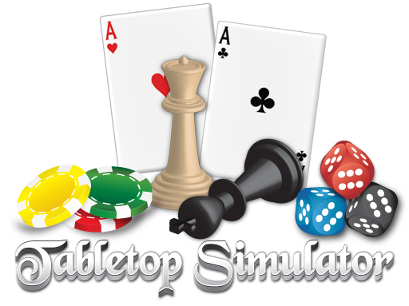

* TO DO:
    * Add a page for the new migration feature
    * Make sure a page outlines what it means to be promoted

##About Tabletop Simulator

Tabletop Simulator is not your everyday simulator. It can be used for a wide variety of things. The general purpose use of it is to play any board, card, and any tabletop game you can think of with up to 10 players.

To get a bit more in-depth, Tabletop Simulator is the ultimate digital platform for not only playing games, but for game designers to use as a prototyping and game creation tool.

You can do things like create Unity AssetBundles with particle effects, lighting, sounds, animations and more, script game behavior and tools with Lua, import 3D models, create games from scratch, manipulate physics, create hinges and joints, and much more! Not only that, but the host can set physics and permissions for players, so you can decide how serious or silly you want your games to be.

Tabletop Simulator is continually growing. We are still adding new features and content, fixing any issues that come up and working with companies to bring official games into TTS.

##This Knowledge Base

There is a LOT you can do in Tabletop Simulator, both as a creator and a player. It is recommended you watch video tutorials and read through this Knowledge Base to explore all the possibilities. If you have questions or want to connect with others, visit the [forums](http://www.berserk-games.com/forums/) or join the [official Discord channel](https://discord.gg/6bv3rEn).
